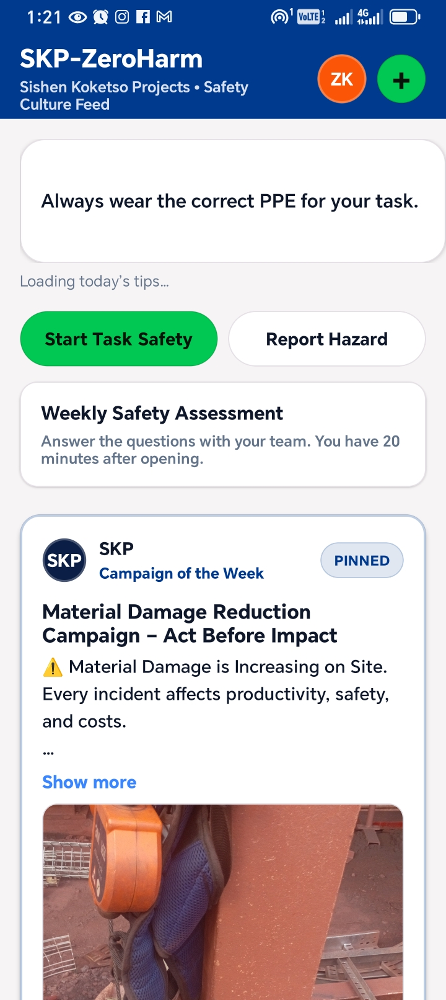
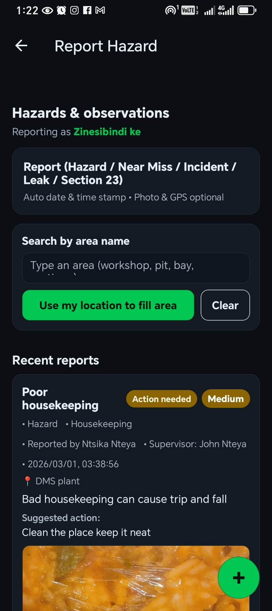
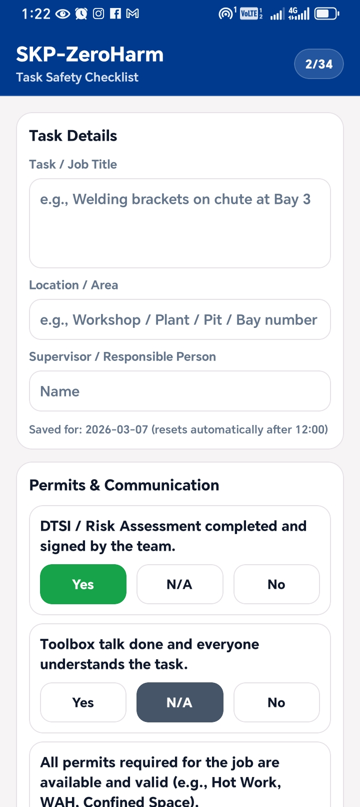
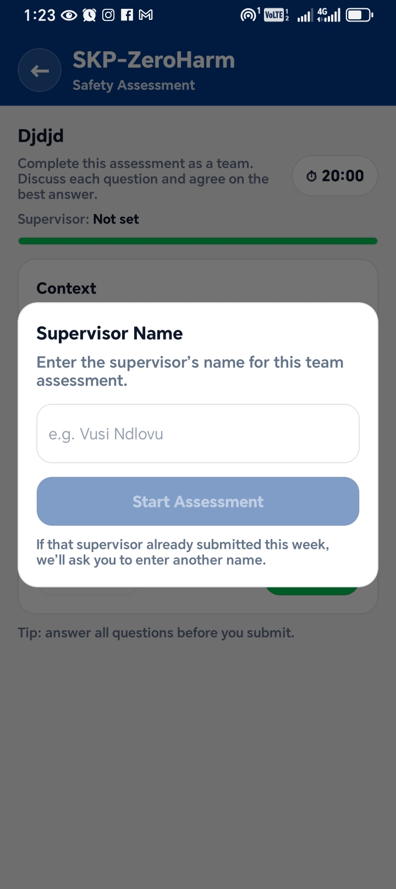
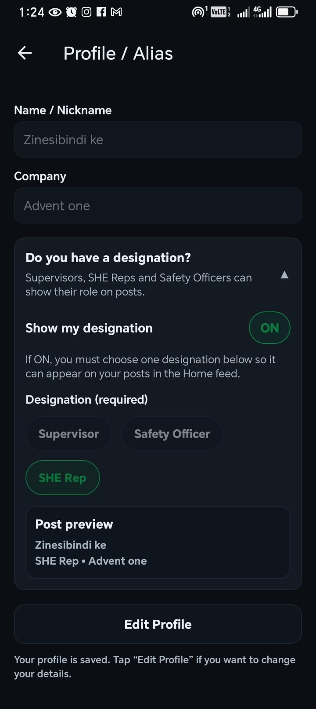
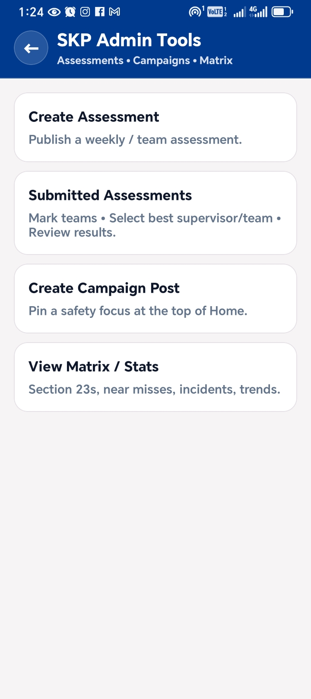
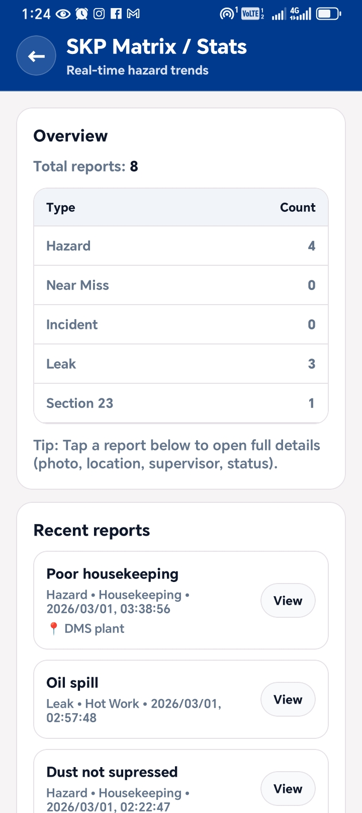

# MyZeroHarm

MyZeroHarm is a mobile safety reporting and awareness app built to improve communication, reporting, and safety culture on site.

## About
This project was designed to help workers and safety teams report hazards faster, complete safety checks, share safety updates, and view trends in real time.
## Problem It Solves
In many workplaces, safety information is not always shared fast enough, and some issues are only discussed during toolbox talks or meetings. MyZeroHarm was built to make hazard reporting, safety communication, and team awareness more immediate, visible, and practical for daily site use.

## Main Features
- Hazard, incident, leak, near-miss, and Section 23 reporting
- Task safety checklist
- Weekly/team safety assessments
- Safety post and campaign sharing
- User profile with designation display
- Admin tools for assessments, campaigns, and matrix/stats
- Matrix/statistics view for real-time reporting trends
- Weekly PDF report generation

## Tech Stack
- React Native
- Expo
- Firebase
- Firestore
- JavaScript

## Screenshots

### Home Screen

### Report Hazard

### Task Safety Checklist

### Safety Assessment

### Profile / Designation

### Admin Tools

### Matrix Overview

## How It Works
Users can report hazards and safety issues directly in the app, complete task safety checklists, participate in team safety assessments, and share safety-related updates. Admin users can manage assessments, campaigns, and reporting statistics through the admin tools section.
## Why I Built This
I work in the mining environment as a SHE Rep, and outside of work I spend my time building software projects. While working on site, I noticed the need for a safety app that could improve how employees and management communicate about hazards, risks, and safety concerns.

Although there was already a reporting system in place, it mainly focused on reporting issues to management. That meant other employees were often unable to see, learn from, or respond to the safety issues being reported around them.

I wanted to build an app that would allow both employees and management to interact around safety and health in a more structured, practical, and educational way. My goal was to create a platform where reporting does not only notify management, but also helps build awareness, learning, and shared responsibility across the workforce.

I presented the idea to SKP management, and the response was positive because the app has the potential to educate employees more effectively about workplace risks and improve overall safety culture.

I built MyZeroHarm because I enjoy challenging myself technically, and I also want to contribute meaningfully to the environments I work in. I like being part of solutions that help improve systems, people, and everyday work.
## Status
This project is actively being improved and expanded.

## Author
Ntsika Nteya
